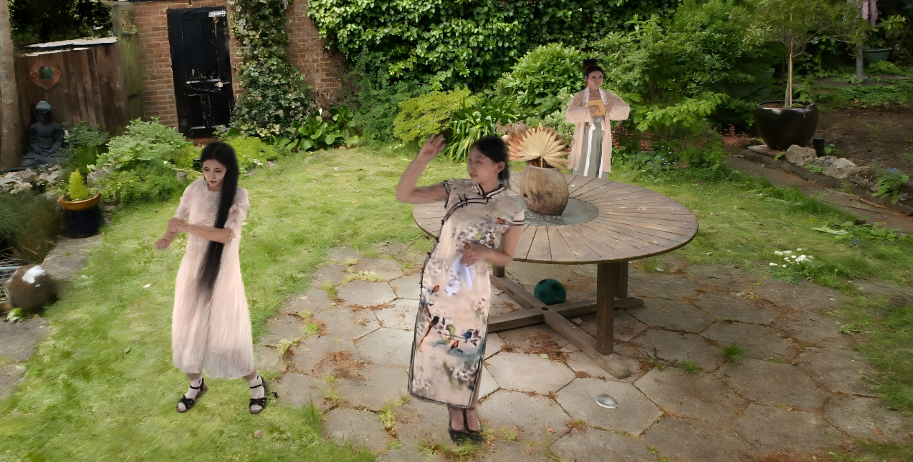

# R3-Avatar: Record and Retrieve Temporal Codebook for Reconstructing Photorealistic Human Avatars
### [Project Page](https://arxiv.org/abs/2503.12751) | [Paper](https://arxiv.org/abs/2503.12751)
>R3-Avatar: Record and Retrieve Temporal Codebook for Reconstructing Photorealistic Human Avatars\
>[Yifan Zhan](https://yifever20002.github.io/), Wangze Xu, [Qingtian Zhu](https://qtzhu.me/), [Muyao Niu](https://myniuuu.github.io/), Mingze Ma, Yifei Liu \
>[Zhihang Zhong](https://zzh-tech.github.io/), Xiao Sun, Yinqiang Zheng

We present R3-Avatar, incorporating a temporal codebook, to overcome the inability of human avatars to be both animatable and of high-fidelity rendering quality. Existing video-based reconstruction of 3D human avatars either focuses solely on rendering, lacking animation support, or learns a pose-appearance mapping for animating, which degrades under limited training poses or complex clothing. In this paper, we adopt a "record-retrieve-reconstruct" strategy that ensures high-quality rendering from novel views while mitigating degradation in novel poses. Specifically, disambiguating timestamps record temporal appearance variations in a codebook, ensuring high-fidelity novel-view rendering, while novel poses retrieve corresponding timestamps by matching the most similar training poses for augmented appearance. Our R3-Avatar outperforms cutting-edge video-based human avatar reconstruction, particularly in overcoming visual quality degradation in extreme scenarios with limited training human poses and complex clothing.

## A. Prerequisite
### `Configure environment`
Create a virtual environment and install the required packages 

    conda create -n r3avatar python=3.7
    conda activate r3avatar
    pip install -r requirements.txt

Install submodules:

    export CUDA_HOME=/usr/local/cuda
    pip install submodules/diff-gaussian-rasterization
    pip install submodules/simple-knn

Install other requirements:

    pip install --upgrade https://github.com/unlimblue/KNN_CUDA/releases/download/0.2/KNN_CUDA-0.2-py3-none-any.whl
    pip install -r requirement_gauhuman.txt

### `Download SMPL(-X) model`

Download the SMPL(-X) from [here](https://drive.google.com/drive/folders/1ULFP2r1RLq5dBrvkK_R_4MTMOB8ej2V4?usp=drive_link) and put it under the main path.

### `Dataset`

For DNA-Rendering dataset, please download it from [here](https://dna-rendering.github.io/inner-download.html). You only need to download the ``xxxx_xx.smc'' and ``xxxx_xx_annots.smc'' files for each case. Our code will automatically preprocess the data during the first run and save the images, bkgd_masks, and model in the corresponding directory.

For ZJU_MoCap dataset, please refer to this [form](https://docs.google.com/forms/d/1QcTp5qIbIBn8PCT-EQgG-fOB4HZ9khpRkT3q2OnH2bs).

## B. Experiments

### Training

    sh scripts/dna_2_0019_10.sh

### Rendering

    sh scripts/dna_2_0019_10_render.sh

We also have similar scripts for other datasets.

## C. Citation

If you find our work useful, please cite it as

@article{zhan2025r3,
  title={R3-Avatar: Record and Retrieve Temporal Codebook for Reconstructing Photorealistic Human Avatars},
  author={Zhan, Yifan and Xu, Wangze and Zhu, Qingtian and Niu, Muyao and Ma, Mingze and Liu, Yifei and Zhong, Zhihang and Sun, Xiao and Zheng, Yinqiang},
  journal={arXiv preprint arXiv:2503.12751},
  year={2025}
}

## E. Acknowledgments

We appreciate for [GauHuman](https://github.com/skhu101/GauHuman), upon which we build our code implementation. 
We would also appreciate the code release of 
[4DGS](https://fudan-zvg.github.io/4d-gaussian-splatting/), 
[GART](https://github.com/JiahuiLei/GART), 
[Dyco](https://ai4sports.opengvlab.com/Dyco/),
[SplattingAvatar](https://initialneil.github.io/SplattingAvatar),
[DressRecon](https://jefftan969.github.io/dressrecon/),
[WonderHuman](https://wyiguanw.github.io/WonderHuman/),
[GPS-Gaussian](https://shunyuanzheng.github.io/GPS-Gaussian)
for comparison and evaluation.

Please also cite SMPL(-X) following

    @article{SMPL:2015,
      author = {Loper, Matthew and Mahmood, Naureen and Romero, Javier and Pons-Moll, Gerard and Black, Michael J.},
      title = {{SMPL}: A Skinned Multi-Person Linear Model},
      journal = {ACM Trans. Graphics (Proc. SIGGRAPH Asia)},
      month = oct,
      number = {6},
      pages = {248:1--248:16},
      publisher = {ACM},
      volume = {34},
      year = {2015}
    }

    @inproceedings{SMPL-X:2019,
      title = {Expressive Body Capture: {3D} Hands, Face, and Body from a Single Image},
      author = {Pavlakos, Georgios and Choutas, Vasileios and Ghorbani, Nima and Bolkart, Timo and Osman, Ahmed A. A. and Tzionas, Dimitrios and Black, Michael J.},
      booktitle = {Proceedings IEEE Conf. on Computer Vision and Pattern Recognition (CVPR)},
      pages     = {10975--10985},
      year = {2019}
    }

